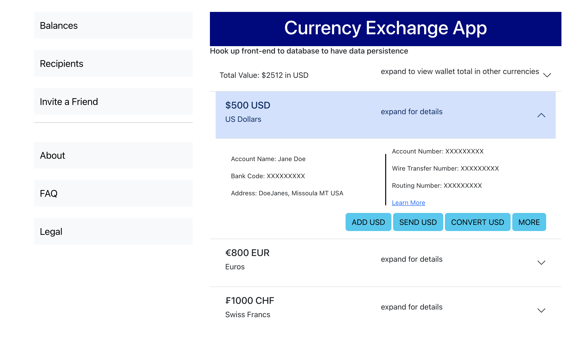

# Currency-Exchange

This is a solution to the [Gatsby-react-currency-wallet-app Challenge](https://github.com/ugglr/gatsby-react-currency-wallet-app). 

## Table of contents

- [Overview](#overview)
  - [The challenge](#the-challenge)
  - [Screenshot](#screenshot)
  - [Links](#links)
- [My process](#my-process)
  - [Built with](#built-with)
  - [Continued development](#continued-development)
- [Author](#author)
- [Acknowledgments](#acknowledgments)

## Overview

### The challenge

We would like you to create a React wallet that can handle different currencies (USD, EUR, CHF, etc) and exchange them between each other.

E.g. John Doe's wallet (Default currency = USD)

- USD balance: 100 USD
- EUR balance: 500 EUR
- CHF balance: 10000 CHF
- Totalised value in USD = 10237.79 USD

Users will be able to exchange from one currency to the other one. Hence, John can decide to exchange his 100USD to his Euro account. After the conversion, he will end up having:

_Considering 1 EUR = 1.24 USD_

- USD balance: 0 USD
- EUR balance: 580.42 EUR
- CHF balance: 10000 CHF
- Totalised value in USD = 10684.50 USD

Users should be able to:

- Exchange between currencies
- Deposit a currency
- Show balance of each currency
- Show totalised value (across all your currencies) in the user's default currency
- Set user's default currency

### Bonus (optional)

- Add new currencies
- Transaction history when user deposits or exchanges money
- Add unit and UI tests
- Include animations

### Criteria 

You will be evaluated primarily on:

- React modern practices
- Code reusability (try making reusable components)
- Asynchronous programming
- Error handling
- Consistency of coding style
- Test coverage
- Accesibility
- Responsiveness
- Design style and UX
- Bonuses

### Screenshot

### Links

- Solution URL: [https://github.com/mariahw4/currency-exchange](https://github.com/mariahw4/currency-exchange)
- Live Site URL: [https://mariahw4.github.io/currency-exchange/](https://mariahw4.github.io/currency-exchange/)

## My process

### Built with

- [React](https://reactjs.org/) - JS library
- [Bootstrap](https://getbootstrap.com/docs/5.3/getting-started/introduction/)
- [React-Bootstrap](https://react-bootstrap.netlify.app/)

This project was bootstrapped with [Create React App](https://github.com/facebook/create-react-app).

## Available Scripts

In the project directory, you can run:

### `npm start`

Runs the frontend of the app in the development mode.\
Open [http://localhost:3000](http://localhost:3000) to view it in your browser.

The page will reload when you make changes.\
You may also see any lint errors in the console.

### `npm test`

Launches the test runner in the interactive watch mode for the frontend of the app.\
See the section about [running tests](https://facebook.github.io/create-react-app/docs/running-tests) for more information.

### `npm run build`

Builds the frontnend of the app for production to the `build` folder.\
It correctly bundles React in production mode and optimizes the build for the best performance.

The build is minified and the filenames include the hashes.\
Your app is ready to be deployed!

See the section about [deployment](https://facebook.github.io/create-react-app/docs/deployment) for more information.

### `npm run eject`

**Note: this is a one-way operation. Once you `eject`, you can't go back!**

If you aren't satisfied with the build tool and configuration choices, you can `eject` the frontnd at any time. This command will remove the single build dependency from the frontend of your project.

Instead, it will copy all the configuration files and the transitive dependencies (webpack, Babel, ESLint, etc) right into your project so you have full control over them. All of the commands except `eject` will still work, but they will point to the copied scripts so you can tweak them. At this point you're on your own.

You don't have to ever use `eject`. The curated feature set is suitable for small and middle deployments, and you shouldn't feel obligated to use this feature. However we understand that this tool wouldn't be useful if you couldn't customize it when you are ready for it.

## Learn More

You can learn more in the [Create React App documentation](https://facebook.github.io/create-react-app/docs/getting-started).

To learn React, check out the [React documentation](https://reactjs.org/).

### Code Splitting

This section has moved here: [https://facebook.github.io/create-react-app/docs/code-splitting](https://facebook.github.io/create-react-app/docs/code-splitting)

### Analyzing the Bundle Size

This section has moved here: [https://facebook.github.io/create-react-app/docs/analyzing-the-bundle-size](https://facebook.github.io/create-react-app/docs/analyzing-the-bundle-size)

### Making a Progressive Web App

This section has moved here: [https://facebook.github.io/create-react-app/docs/making-a-progressive-web-app](https://facebook.github.io/create-react-app/docs/making-a-progressive-web-app)

### Advanced Configuration

This section has moved here: [https://facebook.github.io/create-react-app/docs/advanced-configuration](https://facebook.github.io/create-react-app/docs/advanced-configuration)

### Deployment

This section has moved here: [https://facebook.github.io/create-react-app/docs/deployment](https://facebook.github.io/create-react-app/docs/deployment)

### `npm run build` fails to minify

This section has moved here: [https://facebook.github.io/create-react-app/docs/troubleshooting#npm-run-build-fails-to-minify](https://facebook.github.io/create-react-app/docs/troubleshooting#npm-run-build-fails-to-minify)

### Continued development

As I continue to develop and improve this application I would like to add the ability to easily add another currency to the wallet - this means that I would need to better break down my code into a component nature to more easily facilitate this addition. 

## Author

- Website - [Mariah Wear - Git hub Profile](https://github.com/mariahw4)
- LinkedIn - [Profile](https://www.linkedin.com/in/mariah-wear/)

## Acknowledgments

Thank you to [Chris Hopen](https://www.linkedin.com/in/chris-hopen-299b3314/) at [Strivve](https://www.linkedin.com/company/strivve-fi/) for setting me this interesting challenge problem!

